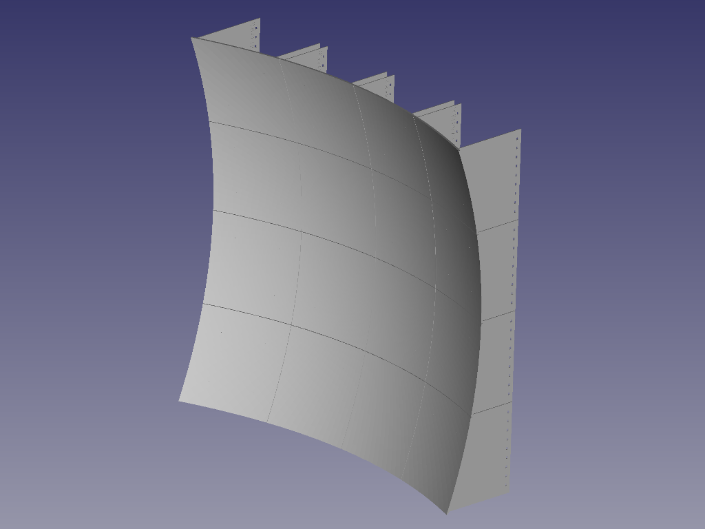
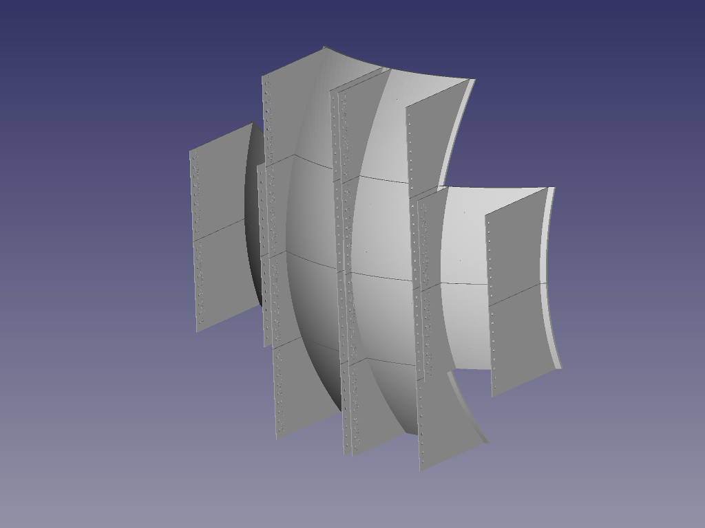
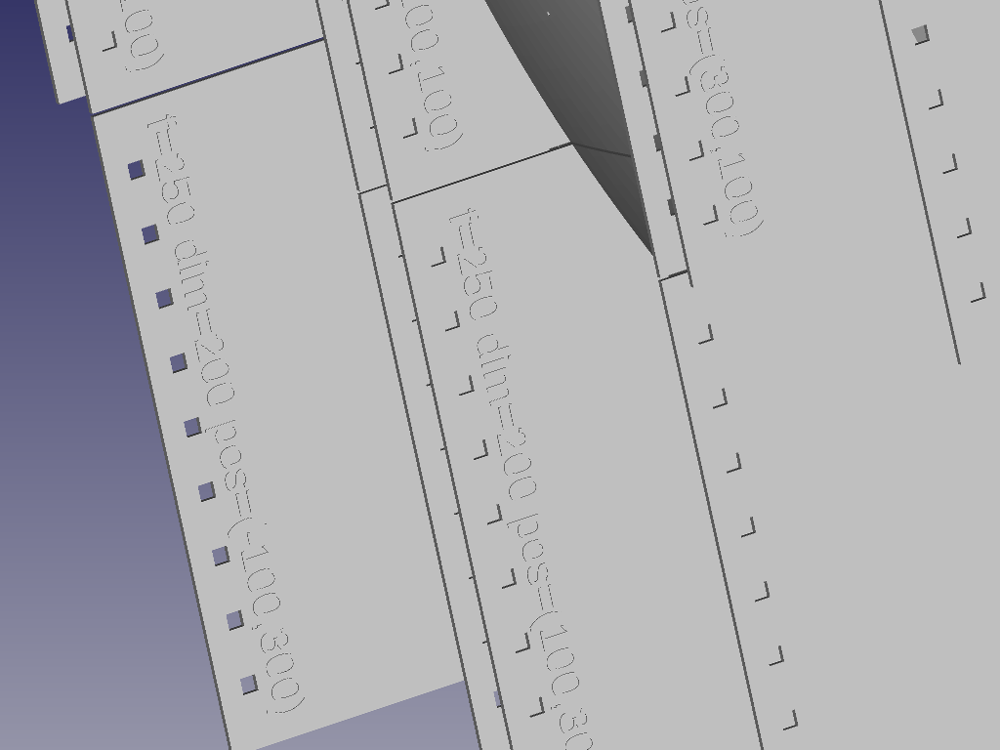

# FDMdish
A 3D printable parabolic dish antenna, written in OpenSCAD, with examples rendered for immediate print.

|  |
|:-:|
| Included example render: 200mm tiles, 800x800mm dish size, focal distance 500mm |

FDMdish is a 3D printable, scalable parabolic reflector surface system suitable for use in a high gain radio antenna setup.
The parametric model is generated in OpenSCAD, STLs can be rendered/exported and used to generate tiles that can be 3D printed. The accompanying Cura slicer settings have been optimised for high speed printing, using a low volume of material for high paraboloid surface accuracy up to ~10Ghz (maybe 20GHz, requires testing).

The tiles are mounted to a frame of 2020 aluminium extrusion.
Use some currently unknown method to place the RF antenna feed at the focal point.

Oh, and FDM is for FreeDoM.

|   |   |
|:-:|:-:|
| Rear view, showing supports | Tiles are labeled |

## Ingredients:
* Ideal 3D printer: Artillery Sidewinder X1, with a 0.8mm nozzle for 1mm line width and 0.5mm layer height. Or equivalent machine
* A few KG of PLA filament, the slicer will tell you how much you need, white is less likely to melt in the sun than black
* Lengths of 2020 vslot extrusion or square hollow section, other widths are possible if you modify the OpenSCAD script
* Brackets to hold the 2020 extrusion in a sturdy frame (see images for examples)
* M5 (ideal), M4 or M3 fasteners and slot nuts
* Beers and patience
* Conductive tape, or conductive nickel spray paint for the reflector surface

## Method:
* Specific custom tiles can be generated by adjusting the parameters in the OpenSCAD script
* Whole dish assemblies can be batch rendered by modifying the parameters in the shell script, and running it (gen_dish.sh)
* The rendered STL files will be stored in the ./render folder
* Check the whole render job, but importing the STLs into a new FreeCAD project
* Load each of these files into your slicer of choice (an optimised profile for CURA and the Sidewinder X1 has been included for tips)
* The 3D printer and slicer should be set up for printing of dimensionally accurate functional components, otherwise there may be a few tight fits
* Print each tile out, trimming the brim
* Once printed, the tiles can be fastened to a grid of 2020 extrusion
* Get creative with ensuring the surface of the dish is electrically conductive, at least in the direction of polarisation, examples include:
 * Copper tape, spaced less than 1/10 wavelength apart
 * Conductive nickel spray paint
 * AluminIum foil and adhesive
 * Thin wire, taped down, ghetto pride
	
	
### Hints on SCAD tweaking:
* A high speed, thick layer height print process is unlikely to be tolerant of anything more than a 45deg overhang
 * So the on-axis diameter should be less than 4 times the focal length
* For a square dish at this critical limit, the corners are likely to exceed this requirement and may need to be discarded

### Hints on slicer settings:
* The SCAD model and slicer settings have been optimised for each other, the outcome may be less than ideal with a narrower nozzle
* The structural strength comes from the aluminium extrusion, these panels are designed to be rigid and low warp, but not load bearing
* 1 shell wall, fill of approximately 5-10% with a zigzag pattern seems to provide enough strength to prevent warping in the paraboloid as it cools
* Black gloss filament is good as a prototyping filament, because the quality of the surface can be quickly observed by looking for variations in the reflective sheen as the tile is rotated under a point source of illumination 
* printing with a brim is essential (these components are large, with a low bed contact area, and are otherwise likely to lift off the bed)

### Hints on printing:
* Approximate time per tile with the described setup: 2-3 hours

